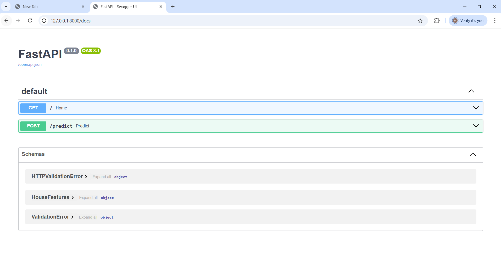
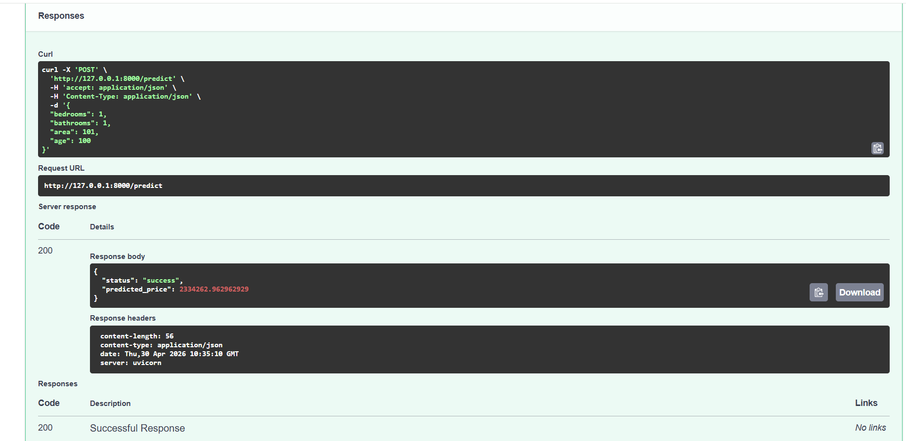
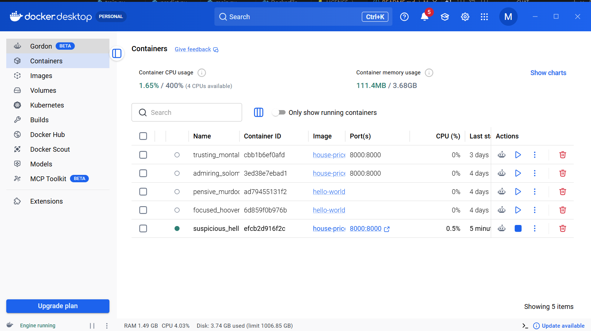

#  House Price Prediction API (Production-Ready ML System)

##  Overview
This project is a production-style Machine Learning system that predicts house prices based on features like bedrooms, bathrooms, area, and age.

##  Features
- End-to-end ML pipeline
- FastAPI backend
- Dockerized deployment
- Input validation & error handling
- Clean project architecture

##  Tech Stack
- Python
- Scikit-learn
- FastAPI
- Docker

##  API Endpoint

### POST /predict

#### Request:
```json
{
  "bedrooms": 3,
  "bathrooms": 2,
  "area": 1500,
  "age": 5
}

#### Response:
```json
{
  "status": "success",
  "predicted_price": 280000
}

##  Screenshots

### Swagger UI


### Prediction Output


### Docker Running

